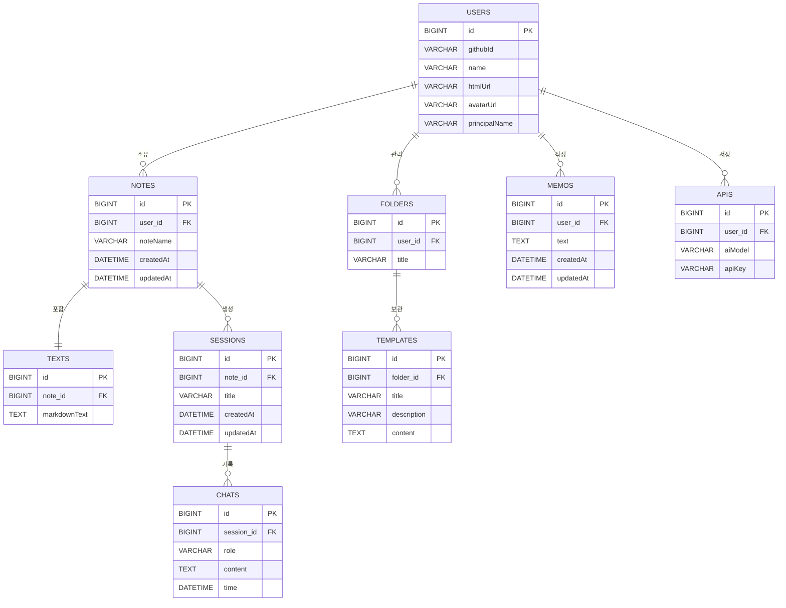

<div align="center">

# **WriteMD**

<!-- [](https://opensource.org/licenses/MIT) -->
[](https://reactjs.org/)
[](https://spring.io/projects/spring-boot)
[](https://www.docker.com/)
[](https://www.cloudflare.com/)

[데모 보기](https://www.writemd.space) • [문서](https://github.com/yi5oyu/writemd/wiki) • [버그 신고](https://github.com/yi5oyu/writemd/issues)

</div>

---

## 🎯 프로젝트 개요

마크다운 문서 작성을 쉽고 빠르게 하기 위한 GitHub와 AI를 연동한 웹 서비스

> 개발기간: 2025.01 ~ 2025.06

### 기술 스택
<div>
<p>


</p>

<p>


<br>


<br>

<br>


</p>

<p>


<br>


<br>


</p>


</div>

### 주요 특징

#### **Frontend**
- **React**: 프론트/백엔드 분리, CSR(Client Side Rendering), 컴포넌트 기반 UI, Custom Hook 로직 재사용
- **Vite**: 빌드도구, HMR(Hot Module Replacement) 지원, 빠른 개발 환경
- **Web Storage**:검색 기록 저장 및 노트 임시 저장, 브라우저 새로고침 시에도 작업 내용 보존
- **Chakra UI**: 컴포넌트 라이브러리, 반응형 디자인
  
#### **Backend**
- **Spring Boot 3**: REST API 서버, MCP 클라이언트
- **Spring AI**: MCP(Model Context Protocol) 클라이언트/서버, 다중 AI API(OpenAI/Anthropic) 연동
- **Spring Security + JWT**: OAuth2 GitHub 로그인, JWT(Access/Refresh Token) 기반 인증, API 접근 제어
- **MySQL + Redis**: 관계형 데이터 관리 + 캐시 성능 최적화
- **실시간 비동기 처리**: @Async + CompletableFuture 멀티스레드 비동기, SSE 실시간 스트리밍, ConcurrentHashMap 동시성 관리
- **JPA + QueryDSL**: 엔티티 ORM(Object-Relational Mapping), 동적 타입 안전 쿼리, N+1 문제 해결
- **Python**: MCP 서버, GitHub API 호출 Tools
  
#### **DevOps**
- **인프라**: Synology NAS 기반 Docker 환경
- **Docker Compose**: 멀티 컨테이너(React/nginx, Spring Boot, Python, MySQL, Redis, Cloudflared) 배포
- **Cloudflare**: CDN(Content Delivery Network), DNS, SSL/TLS 자동 관리, DDoS 보호, Zero Trust Tunnel
- **모니터링**: Spring Actuator + Prometheus 메트릭 수집, Grafana 시각화, Portainer 컨테이너 관리
- **CI/CD**: Self-hosted GitHub Runner, GitHub Actions (빌드/배포), GitHub Container Registry, 자동 이미지 배포
  
---

## 🏗️ 아키텍처  


`네트워크 구조 Cloudflared`    


`MCP 아키텍처`


  
`AI 채팅 플로우`


`ERD`


---

## 🌟 주요 기능

### 마크다운 에디터
- **Monaco Editor**: VS Code와 동일한 편집 환경(문법 하이라이트, 자동완성, 단축키)
- **실시간 미리보기**: 편집과 동시에 마크다운 결과 확인(GitHub Flavored Markdown)
- **다이어그램 지원**: Mermaid.js 기반 플로우차트, 시퀀스 다이어그램 등...
- **명령어**: `/` 입력으로 다양한 요소(뱃지, 알림 등...) 빠른 삽입

### AI 채팅
- **개인 API 키 등록**: 사용자 본인의 OpenAI/Anthropic API 키 등록 후 이용
- **다중 AI 모델**: GPT, Claude API 키/AI 모델 선택
- **토큰 사용량**: 개인 API 키 토큰 사용량
- **채팅 내역**: 채팅 히스토리 관리 및 검색
- **실시간 스트리밍**: Spring AI Flux 기반 리액티브 스트림 + SSE로 AI 응답 실시간 수신

<video src="./video/writemdchat.mp4" controls="controls" width="100%"></video>

### MCP Tools
- **문서 분석**: AI 기반 마크다운 문서 검토 및 개선 제안
- **Github Repository 분석**: 6단계 자동 분석 (기본정보 > 기술스택 > 구조 > 설정 > 배포 > 결론)

<video src="./video/writemdgit.mp4" controls="controls" width="100%"></video>

### 문서 관리
- **편집 모드**: 노트/템플릿/메모/GitHub/Report 모드 전환
- **자동 저장**: 브라우저 종료 후에도 작업 내용 저장
- **검색/정렬**: 각 모드별 실시간 검색 필터링, 최근 사용 문서 날짜별 정렬
  
### Github 연동
- **OAuth2 인증**: GitHub 로그인 및 토큰 관리
- **레포지토리 목록**: 사용자의 GitHub 저장소 전체 조회 및 시각화
<!-- - **파일 탐색**: 레포지토리 구조 분석, 폴더/파일 네비게이션 -->
- **파일 관리**: GitHub API 기반 파일 내용 조회, 생성, 수정

### 인증/보안
- **JWT 인증**: Access Token(30분) + Refresh Token(7일) 방식
- **토큰 관리**: Redis 기반 Refresh Token 저장 및 블랙리스트 관리

---

## 📊 [모니터링](https://github.com/yi5oyu/writemd/wiki/%EB%AA%A8%EB%8B%88%ED%84%B0%EB%A7%81)

**Spring Actuator, Prometheus, Grafana**를 연동해 수집된 데이터를 대시보드로 시각화하고 **k6**를 사용해 부하 테스트해 병목 측정/개선
  
### 성능 개선

#### [API 응답시간 개선](https://github.com/yi5oyu/writemd/wiki/API-%EC%9D%91%EB%8B%B5%EC%8B%9C%EA%B0%84-%EA%B0%9C%EC%84%A0)

`단일 사용자 테스트 모니터링`

1. **로그인 리다이렉트** (평균 응답시간 832ms → 348ms)

- **문제**
  - 디스크 읽기: 신규 유저 가입 시마다 초기 템플릿 데이터(JSON 파일 2개)를 디스크에서 반복적으로 읽어옴
  - 동기 처리: 유저 정보 저장, 폴더 생성, 템플릿 생성이 하나의 트랜잭션 내에서 순차적으로 실행됨
- **해결**
  - 초기 데이터 캐싱: 애플리케이션 최초 실행시 JSON 파일을 Redis에 미리 저장
  - 이벤트 기반 비동기 처리: `Spring Events`를 사용해 핵심 로직(DB 저장)과 부가 로직(초기 데이터 생성, 캐시 갱신)을 분리/비동기 처리
<!-- DB 트랜잭션 커밋 후(afterCommit), 캐시 정보를 갱신하도록 TransactionSynchronizationManager 적용. -->

2. **노트 생성** (평균 응답시간 204ms → 134ms)

- **문제**
  - 중복 조회: 노트 생성에 사용자 정보를 DB에서 재조회하는 불필요한 쿼리 발생
  - 비효율적 쓰기: 노트와 텍스트 엔티티 저장이 분리돼있어 두번 쿼리 요청 발생
- **해결**
  - 사용자 캐싱: 반복되는 사용자 조회를 Redis 캐싱
  - Cascade 설정: 연관관계 설정으로 노트와 텍스트 엔티티 일괄 처리

#### [DB 인덱스](https://github.com/yi5oyu/writemd/wiki/DB-%EC%9D%B8%EB%8D%B1%EC%8A%A4)

`EXPLAIN을 사용한 쿼리 실행 계획 분석`

1. **커버링 인덱스와 조회 성능 최적화**

- 자동 생성된 PK 클러스터드 인덱스와 JPA/Hibernate에 의해 자동 생성된 FK/UK 비클러스터드 인덱스 분석
  - 자주 사용되는 `github_id` 인덱스 추가

2. **복합 인덱스와 데이터 분포에 따른 성능 분석**

- 변경이 적고 조회가 많은 쿼리 복합 인덱스 추가
  - `Folders`와 `Templates`를 조인해 모든 템플릿을 조회하는 인덱스 분석
  - 적은 데이터: MySQL 옵티마이저가 인덱스 스캔보다 풀 스캔이 더 빠르다고 판단해 인덱스 사용안함
  - 데이터 분포: 전체 데이터가 증가하고 조회 대상이 적을수록 인덱스 효율 증가

3. **정렬 최적화**

- 채팅 대화 조회 시 매번 시간순 정렬 작업 발생
  - 정렬을 포함한 인덱스가 생성 시점부터 정렬 저장되어 읽기만 하면됨

#### [리팩토링](https://github.com/yi5oyu/writemd/wiki/%EB%A6%AC%ED%8C%A9%ED%86%A0%EB%A7%81)

`N+1 문제`

1. **데이터 삭제 배치 처리**

- 사용자 탈퇴 시 연관된 테이블에 관련된 N+1 쿼리 발생
  - QueryDSL 배치 삭제: 엔티티 조회 없이 DB에 직접 조건에 맞는 데이터를 한 번에 처리하는 배치 쿼리 작성

2. **연관 엔티티 조회 N+1 문제 해결**

- 템플릿 목록 조회 시 유저 조회 -> 폴더 목록 조회 -> 각 폴더별 템플릿 조회 쿼리가 발생하는 **N+1 문제** 발생
  - QueryDSL Fetch Join: 연관된 데이터를 한 번의 쿼리로 처리

`Redis 캐싱`
  
1. **정적 데이터(JSON) 디스크 I/O 제거**

- 신규 유저 가입 시마다 초기 데이터(JSON 파일)을 디스크에서 읽어오는 I/O 병목 발생
  - 어플리케이션 서버 시작할때 JSON 데이터를 Redis에 미리 저장

2. **반복 조회 데이터 캐싱**

- 반복적으로 발생할 수 있는 요청 데이터 Redis 캐싱

### [K6 부하테스트](https://github.com/yi5oyu/writemd/wiki/K6-%EB%B6%80%ED%95%98-%ED%85%8C%EC%8A%A4%ED%8A%B8)

`P95 응답 시간 500ms 미만, 에러율 1% 미만 유지 가능한 인프라 한계 측정`

#### 성능 측정/최적화

1. **DB없는 API 테스트**
* 최대 4000명 부하 시 스레드 대기 현상으로 P95 응답 시간 1392ms
* 스레드 풀을 500개로 증가시키고 안정적인 처리가 가능한 임계치인 2500명으로 유저 수를 조정해 P95 응답시간 **419ms** 측정
1. **실제 사용자 시나리오 테스트**
* 최대 1000명, 복합 API 호출 시 DB 커넥션 부족으로 P95 응답 시간 2431ms
* DB 커넥션 풀을 10개에서 30개로 증가시키고 WAS 스레드와 유저 수를 조정해 P95 응답시간 **419ms** 측정

---

<!-- 
## 🗺️ 향후 계획 로드맵

### Frontend
 - 반응형 웹 디자인
 - 다크모드 테마 기능
 - GitHub UI/UX 개선

### Backend
 - GitHub 기능 개선(브랜치, PR/이슈 등...)
 - AI 채팅 메타데이터(토큰 사용량, AI 설정 세부 정보) 추가
 - 게스트 모드 추가
 - 외부 SSE MCP 서버 연결/외부 API를 활용한 MCP Tool 추가 
 - 내부 정보를 활용한 AI 서비스(Spring boot 기반 MCP 서버 Tool) 추가

### Infra
 - AWS 서버 추가 확장

---
-->

## 📜 개발 컨벤션

|     | Java | Javascript |
|---------|-----|-----|
|  `Framework` / `Library`  | Spring Boot 3  | React  |
|  `분석도구`  |  [Checkstyle](https://checkstyle.sourceforge.io/) | [ESLint](https://eslint.org/)  |
|  `포메팅`  | [Google Style](https://google.github.io/styleguide/javaguide.html)  | [Prettier](https://prettier.io/)  |
|  `형상관리`  | Git  | Git  |
|  `빌드도구`  | Gradle  | Vite  |

#### [checkstyle.xml](https://github.com/yi5oyu/Study/blob/main/SpringBoot/%EC%BB%A8%EB%B2%A4%EC%85%98/checkstyle.xml)
    임포트, 주석, 구조 등을 생략한 checkstyle 설정 파일
    writemd/backend/checkstyle/checkstyle-writemd.xml

**주요 특징**  
 - 들여쓰기(tabSize) 변경(2 > 4)
 - [build.gradle](https://github.com/yi5oyu/Study/blob/main/SpringBoot/%EC%BB%A8%EB%B2%A4%EC%85%98/build.gradle) 파일에 checkstyle 설정 추가  

 > ./gradlew check

#### [settings.json](https://github.com/yi5oyu/Study/blob/main/IDE/VScode/%EB%B6%84%EC%84%9D%EB%8F%84%EA%B5%AC/settings.json)
    VSCode 설정 파일(오토 포메팅, 테마 등 플러그인 설정)
    .vscode/settings.json

 - `VSCode 플러그인`

    - Extension Pack for Java
    - Checkstyle for Java
    - Prettier - Code formatter
    - Gradle for Java
    - Git Graph
    - ES7 + React/Redux/React-Native/JS snippets
    - Markdown All in One
    - One Dark Pro
    - Material Icon Theme
  
### 네이밍 컨벤션

`Java`

    // PackageName
    package com.writemd.backend;

    // TypeName(ClassName)
    public class NamingConvention {
        // MemberName
        private String memberName = "전역변수";

        // ConstantName
        public static final int MAX_LIMIT = 100;

        // MethodName, ParameterName
        public void methodName(String parameterName) {
            // LocalVariableName
            String localVariableName = "지역변수";
            System.out.println(localVariableName + memberName);
        }
    }

`Javascript`

    // JSX
    const ComponentName = () => {

        // state
        const [user, setUser] = useState("user");

        return (
            <>
            </>
        );
    }

### 커밋 컨벤션

    type(옵션): Subject (#이슈번호) 
    (공백)
    body (커밋 내용)

    ex)
    feat : 홈화면 추가 (#1)

    - 레이아웃 구성

- 타입
  
    `feat` : 기능 추가/수정  
    `fix` : 버그 수정  
    `docs` : 문서 추가/수정  
    `setting` : 환경설정  
    `test` : 테스트 코드 추가/수정  
    `rename` : 파일/폴더 이름 변경  
    `remove` : 파일/폴더 삭제  
    `design` : UI 디자인 변경  

 [> 커밋 컨벤션](https://github.com/yi5oyu/Study/blob/main/git/%EA%B9%83%20%EC%BB%A4%EB%B0%8B%20%EB%A9%94%EC%84%B8%EC%A7%80)

### 브랜치 전략
    GitHub Flow

    메인 브랜치에서 새로운 브랜치를 생성

    feature/[이슈번호-이름]
    bugfix/[이슈번호-버그명]    

 - [Git Flow](https://github.com/yi5oyu/Study/blob/main/git/branch/git%20flow) vs [GitHub Flow](https://github.com/yi5oyu/Study/blob/main/git/branch/github%20flow)

---

## 환경설정

### docker-compose.yml

`파일 위치`     
/volume1/docker/writemd/docker-compose.yml  
/volume1/docker/writemd/.env    

`.env`      
```
# Database
MYSQL_ROOT_PASSWORD=mysql_root_password     
MYSQL_USER_PASSWORD=mysql_user_password     

# Redis 
REDIS_PASSWORD=redis_password       

# GitHub OAuth
GITHUB_CLIENT_ID=github_client_id       
GITHUB_CLIENT_SECRET=github_client_secret       
GITHUB_REDIRECT_URI=http://localhost:8888/login/oauth2/code/github      
// https://api.writemd.space/login/oauth2/code/github       

# Frontend
FRONTEND_URL=frontend_url(http://localhost:5173)
// https://www.writemd.space

# Cloudflare
CLOUDFLARE_TUNNEL_TOKEN=cloudflare_tunnel_token

# Github Runner
RUNNER_TOKEN=github_runner_token 
# Registration Token 일회용 (A로 시작)

ACCESS_TOKEN=github_access_token
# Personal Access Token (ghp_로 시작)
GitHub > Settings > Developer settings > Personal access tokens
권한 설정
 - repo (모든 하위 권한 포함)
 - workflow
 - admin:repo_hook
 - read:org

# JWT_SECRET
JWT_SECRET=16진수_문자열
HS256(HMAC-SHA256) 서명에 사용되는 비밀 키(64바이트를 16진수로 표현)
키 생성(터미널): openssl rand -hex 64
```

### Git Actions Secret

`Repository` > `Settings` > `Secrets and variables` > `New Repository secret`

VITE_API_URL=backend_url(http://localhost:8888)     
// https://api.writemd.space        

### GitHub Developer Settings

`https://github.com/settings/profile` > `Developer Settings` > `OAuth Apps` > `project_name`

Homepage URL        
`http://localhost:5173`      
// https://www.writemd.space        

Authorization callback URL      
`http://localhost:8888/login/oauth2/code/github`        
// https://api.writemd.space/login/oauth2/code/github       

---

## 📱 빠른 체험

### 온라인 데모
[WriteMD.space 바로 체험하기](https://www.writemd.space)

### 로컬 실행

- [로컬 실행 가이드](https://github.com/yi5oyu/writemd/wiki/%EB%A1%9C%EC%BB%AC-%EC%8B%A4%ED%96%89)

```
요구 사항
- Docker 실행 환경
- Git 설치
- GitHub 계정

환경 설정
- GitHub OAuth App 등록
- git clone https://github.com/yi5oyu/writemd.git
- 프로젝트 루트/.env

실행
- 터미널 실행
- docker-compose up -d
- http://localhost:5173 접속

포트
- Frontend: 5173
- Backend: 8888  
- MySQL: 3307
- Redis: 6380
- MCP Server: 9889
```
