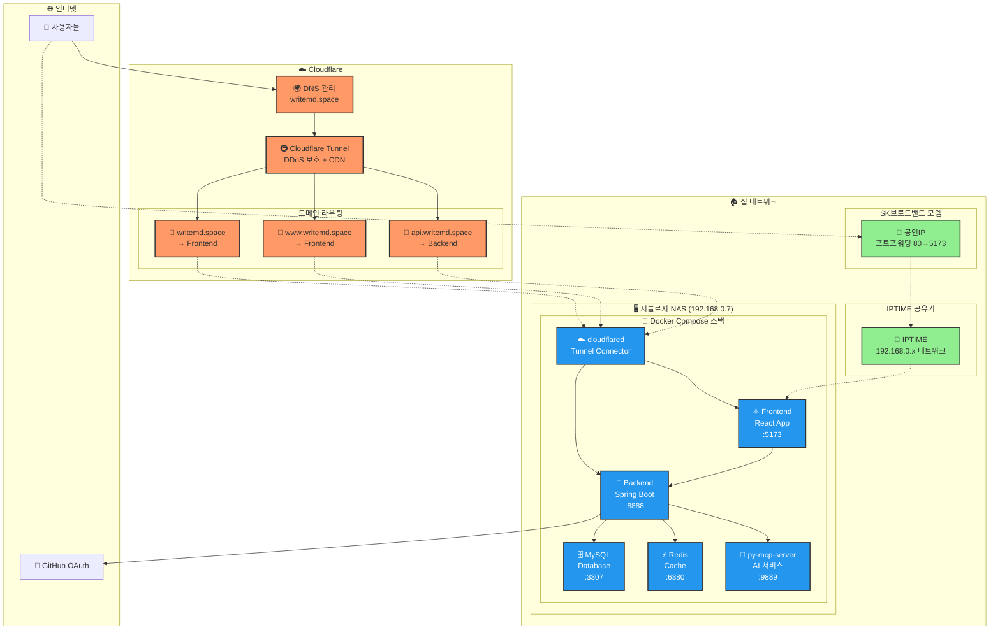

# Markdown AI Writer

> **AI 기반 마크다운 에디터 및 글쓰기 도우미**  
> 실시간 협업과 AI 어시스턴트를 통한 스마트한 글쓰기 경험 제공

---

## 📑 목차
- [🎯 프로젝트 개요](#-프로젝트-개요)
- [🏗️ 시스템 아키텍처](#️-시스템-아키텍처)
- [💻 기술 스택](#-기술-스택)
- [✨ 주요 기능](#-주요-기능)
- [🚀 설치 및 실행](#-설치-및-실행)
- [📐 개발 컨벤션](#-개발-컨벤션)
- [🔧 개발 환경 설정](#-개발-환경-설정)
- [📊 성능 및 모니터링](#-성능-및-모니터링)
<!-- - [🔒 보안](#-보안) -->
- [📈 향후 계획](#-향후-계획)

---

## 🎯 프로젝트 개요

### **💡 프로젝트 배경**
- **문제 상황**: [기존 마크다운 에디터의 한계점]
- **해결 방안**: [AI 기반 글쓰기 도우미 도입]
- **목표**: [사용자 경험 개선 및 생산성 향상]

### **📈 주요 성과**
- ✅ **성능**: [로딩 시간, 응답 속도 등]
- ✅ **사용성**: [사용자 피드백, 만족도 등] 
- ✅ **기술적**: [코드 품질, 테스트 커버리지 등]

---

## 🏗️ 시스템 아키텍처

### **🎨 전체 아키텍처**

## 💻 기술 스택

### Frontend
| 항목 | 기술 스택 |
|------|-----------|
| Framework | React 18 + TypeScript |
| Styling | Tailwind CSS + Styled Components |
| Build Tool | Vite |
| State | Redux Toolkit + RTK Query |
| Testing | Jest + React Testing Library |
| Editor | Monaco Editor / CodeMirror |

### Backend
| 항목 | 기술 스택 |
|------|-----------|
| Framework | Spring Boot 3.x |
| Language | Java 17 |
| Database | MySQL 8.0 |
| Cache | Redis |
| Security | Spring Security + OAuth2 |
| Monitoring | Spring Actuator |

### DevOps & Infrastructure
| 항목 | 기술 스택 |
|------|-----------|
| Container | Docker + Docker Compose |
| CDN | Cloudflare (DNS + Tunnel) |
| HTTPS | Cloudflare SSL |
| Hosting | 시놀로지 NAS (홈서버) |
| Monitoring | 추가 예정 |

## ✨ 주요 기능

### 🤖 AI 기반 글쓰기 도우미

- 실시간 제안: 문맥에 맞는 내용 추천
- 문법 검사: 맞춤법 및 문법 오류 감지
- 스타일 개선: 글쓰기 스타일 향상 제안

### 📝 마크다운 에디터

- 실시간 미리보기: WYSIWYG 방식 지원
- 신택스 하이라이팅: 코드 블록 강조 표시
- 단축키 지원: 효율적인 편집 환경

### 👥 사용자 관리

- GitHub OAuth: 간편한 소셜 로그인
- 프로필 관리: 사용자 정보 및 설정
- 권한 관리: 역할 기반 접근 제어

### 📊 데이터 관리

- 자동 저장: 실시간 데이터 백업
- 버전 관리: 문서 이력 추적
- 내보내기: 다양한 형식 지원

## 개발 컨벤션

|     | Java | Javascript |
|---------|-----|-----|
|  `Framework` / `Library`  | Spring Boot 3  | React  |
|  `분석도구`  |  [Checkstyle](https://checkstyle.sourceforge.io/) | [ESLint](https://eslint.org/)  |
|  `포메팅`  | [Google Style](https://google.github.io/styleguide/javaguide.html)  | [Prettier](https://prettier.io/)  |
|  `형상관리`  | Git  | Git  |
|  `빌드도구`  | Gradle  | Vite  |

#### [checkstyle.xml](https://github.com/yi5oyu/Study/blob/main/SpringBoot/%EC%BB%A8%EB%B2%A4%EC%85%98/checkstyle.xml)
    임포트, 주석, 구조 등을 생략한 checkstyle 설정 파일
    writemd/backend/checkstyle/checkstyle-writemd.xml

**주요 특징**  
 - 들여쓰기(tabSize) 변경(2 > 4)
 - [build.gradle](https://github.com/yi5oyu/Study/blob/main/SpringBoot/%EC%BB%A8%EB%B2%A4%EC%85%98/build.gradle) 파일에 checkstyle 설정 추가  

 > ./gradlew check

#### [settings.json](https://github.com/yi5oyu/Study/blob/main/IDE/VScode/%EB%B6%84%EC%84%9D%EB%8F%84%EA%B5%AC/settings.json)
    VSCode 설정 파일(오토 포메팅, 테마 등 플러그인 설정)
    .vscode/settings.json

 - `VSCode 플러그인`

    - Extension Pack for Java
    - Checkstyle for Java
    - Prettier - Code formatter
    - Gradle for Java
    - Git Graph
    - ES7 + React/Redux/React-Native/JS snippets
    - Markdown All in One
    - One Dark Pro
    - Material Icon Theme
  
### 네이밍 컨벤션

`Java`

    // PackageName
    package com.writemd.backend;

    // TypeName(ClassName)
    public class NamingConvention {
        // MemberName
        private String memberName = "전역변수";

        // ConstantName
        public static final int MAX_LIMIT = 100;

        // MethodName, ParameterName
        public void methodName(String parameterName) {
            // LocalVariableName
            String localVariableName = "지역변수";
            System.out.println(localVariableName + memberName);
        }
    }

`Javascript`

    // JSX
    const ComponentName = () => {

        // state
        const [user, setUser] = useState("user");

        return (
            <>
            </>
        );
    }

### 커밋 컨벤션

    type(옵션): Subject (#이슈번호) 
    (공백)
    body (커밋 내용)

    ex)
    feat(FE) : 홈화면 추가 (#1)

    - 레이아웃 구성

- 타입
  
    `feat` : 기능 추가/수정  
    `fix` : 버그 수정  
    `docs` : 문서 추가/수정  
    `setting` : 환경설정  
    `test` : 테스트 코드 추가/수정  
    `rename` : 파일/폴더 이름 변경  
    `remove` : 파일/폴더 삭제  
    `design` : UI 디자인 변경  

 [> 커밋 컨벤션](https://github.com/yi5oyu/Study/blob/main/git/%EA%B9%83%20%EC%BB%A4%EB%B0%8B%20%EB%A9%94%EC%84%B8%EC%A7%80)

### 브랜치 전략
    GitHub Flow

    메인 브랜치에서 새로운 브랜치를 생성

    feature/[이슈번호-이름]
    bugfix/[이슈번호-버그명]    

 - [Git Flow](https://github.com/yi5oyu/Study/blob/main/git/branch/git%20flow) vs [GitHub Flow](https://github.com/yi5oyu/Study/blob/main/git/branch/github%20flow)