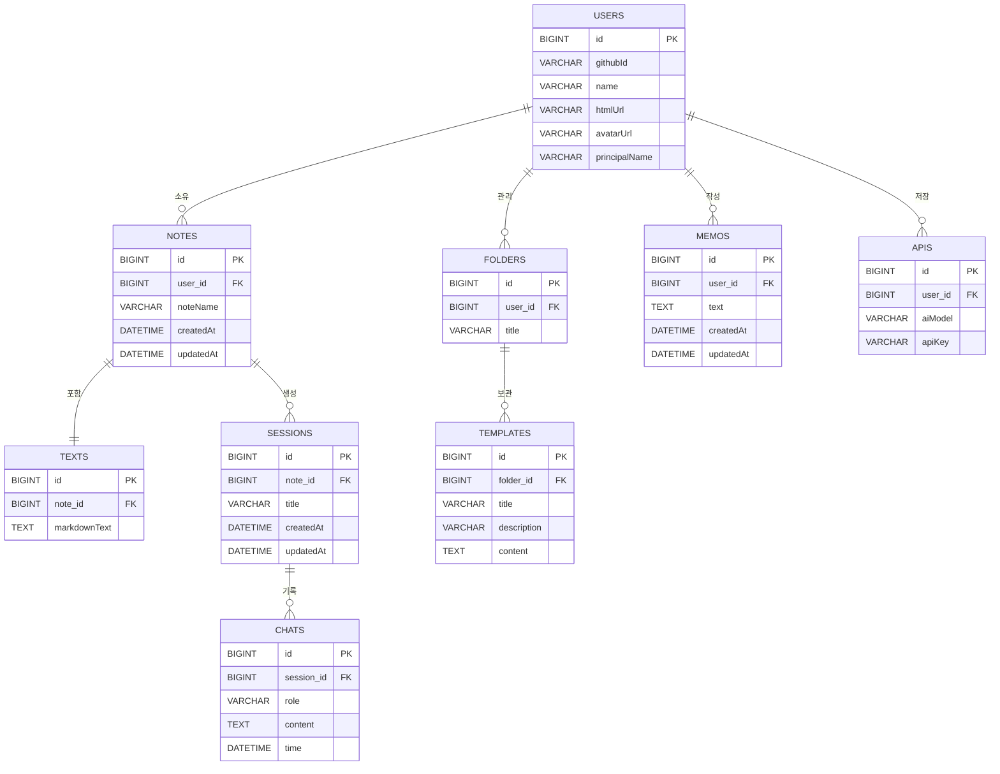

<div align="center">

# **WriteMD**

<!-- [](https://opensource.org/licenses/MIT) -->
[](https://reactjs.org/)
[](https://spring.io/projects/spring-boot)
[](https://www.docker.com/)
[](https://www.cloudflare.com/)

[웹 사이트](https://www.writemd.space) • [문서](https://github.com/yi5oyu/writemd/wiki) • [버그 신고](https://github.com/yi5oyu/writemd/issues)

</div>

---

## 🎯 프로젝트 개요

문서화를 위한 마크다운 작성과 GitHub 파일 연동을 쉽고 빠르게 처리할 수 있도록 AI 기능을 추가한 마크다운 에디터 웹 서비스

> 개발기간: 2025.01 ~ 2025.06

### 기술 스택
<div>
<p>


</p>

<p>


<br>


<br>

<br>


</p>

<p>


<br>


<br>


</p>


</div>

---

## 🌟 주요 기능

### 마크다운 에디터

- **Monaco Editor**: VS Code와 동일한 편집 환경(문법 하이라이트, 자동완성, 단축키)
- **실시간 미리보기**: 편집과 동시에 마크다운 결과 확인(GitHub Flavored Markdown)
- **다이어그램**: Mermaid.js 기반 플로우차트, 시퀀스 다이어그램 등...
- **명령어**: `/` 입력으로 다양한 요소(뱃지, 알림 등...) 빠른 삽입

### AI 어시스턴트 & 채팅

- **개인 API 키 등록**: 사용자 본인의 OpenAI/Anthropic API 키 등록 후 이용
- **게스트 기본 키**: 게스트는 API 키 없이 서비스 제공 기본 키로 AI 채팅 체험
- **다중 LLM 모델**: GPT, Claude API 키/LLM 모델 선택
- **실시간 스트리밍**: Spring AI Flux 기반 리액티브 스트림 + SSE로 LLM 응답 실시간 수신

<video src="https://github.com/user-attachments/assets/51d527af-5b56-4b45-853e-213cb2be7808" controls="controls" width="100%"></video>

### MCP Tools

- **문서 분석**: AI 기반 마크다운 문서 검토, 개선 제안
- **Github Repository 분석**: 6단계 자동 분석 (기본정보 > 기술스택 > 구조 > 설정 > 배포 > 결론)

<video src="https://github.com/user-attachments/assets/92296bcd-39ca-48c1-aa96-7415fbc0616a" controls="controls" width="100%"></video>

### 문서 관리

- **편집 모드**: 노트/템플릿/메모/GitHub/AI 분석 레포트 모드 전환
- **자동 저장**: 브라우저 종료 후에도 작업 내용 저장
- **검색/정렬**: 각 모드별 실시간 검색 필터링, 최근 사용 문서 날짜별 정렬

### Github 연동

- **OAuth2 인증**: GitHub 로그인 및 토큰 관리
- **레포지토리 목록**: 사용자의 GitHub 저장소 전체 조회 및 시각화
<!-- - **파일 탐색**: 레포지토리 구조 분석, 폴더/파일 네비게이션 -->
- **파일 관리**: GitHub API 기반 파일 내용 조회, 생성, 수정

### 게스트 모드

- **1‑클릭 체험**: 회원가입·GitHub 로그인 없이 임시 게스트 계정으로 즉시 서비스 이용
- **기본 AI 제공**: 개인 API 키 없이 서비스가 제공하는 기본 키로 AI 채팅 체험
- **자동 정리**: 매일 새벽 4시 스케줄러가 만료된(24시간 경과) 게스트 계정과 연관 데이터(노트·폴더 등)를 일괄 삭제해 DB 부하 관리

### 인증/보안

- **JWT 인증**: Access Token(30분) + Refresh Token(7일) 무상태(Stateless) 방식
- **XSS 방어 저장 전략**: Access Token은 JS 접근이 불가한 인메모리(모듈 스코프)에, Refresh Token은 HttpOnly 쿠키에 저장해 스크립트 기반 토큰 탈취 차단
- **Silent Refresh**: Access Token 만료·새로고침 시 HttpOnly 쿠키로 자동 재발급해 무중단 세션 유지
- **토큰 관리**: Redis 기반 Refresh Token 저장/회전(Rotation), 로그아웃 시 Access Token 블랙리스트 등록 및 디바이스별 토큰 무효화

---

## ✨ 주요 특징

### **Frontend**

- **React**
  - 클라이언트 사이드 렌더링(CSR) 구조로 프론트/백엔드 분리해 서버 자원 최적화
  - 컴포넌트 UI 모듈화, 노트·템플릿·메모 등 다양한 편집 모드 간 코드 중복 제거
  - Custom Hook으로 데이터 요청/응답 처리와 상태 변경 로직을 UI 렌더링과 분리해 재사용성 향상

- **Vite**
  - HMR을 통해 브라우저 새로고침 없이 즉시 수정한 코드를 화면에 반영해 빠른 개발 환경 제공
  - Esbuild 사전 번들링으로 여러 외부 라이브러리가 포함된 환경에서도 개발 서버 구동 시간 단축

- **Web Storage**
  - 자주 참조하는 정적 검색 기록 및 작성 중인 노트를 로컬 캐싱해 불필요한 서버 API 요청 감소
  - 예기치 못한 브라우저 종료나 새로고침 시에도 유저가 편집하던 마크다운 임시 작성본을 복구해 사용자 경험(UX) 보장

- **Chakra UI**
  - Props 기반의 테마와 완성형 UI 컴포넌트를 활용한 화면 설계, CSS 스타일링 생산성 향상

### **Backend**

- **Spring Boot 3.x**
  - Spring MVC 기반 REST API를 개발하고 record 기반의 불변 DTO 구조를 설계해 비동기/멀티스레드 환경에서 스레드 안전성(Thread-Safe) 확보

- **Spring Security + JWT**
  - GitHub 소셜 로그인 + 게스트 로그인 지원, JWT(Access/Refresh Token) 무상태 인증을 사용해 서버의 세션 관리 부담을 제거한 무상태(Stateless) 환경 설계
  - Access Token 인메모리 + Refresh Token HttpOnly 쿠키 저장으로 XSS 기반 토큰 탈취 방어
  - 필터 체인을 활용해 인증 유무에 따른 접근 권한을 분리하고 비인가 사용자의 API 엔드포인트 접근 제한

- **Async + CompletableFuture**
  - 외부 API 호출 시 CompletableFuture 기반의 비동기 파이프라인을 구축하고 @Async 전용 스레드 풀 설정해 메인 스레드 블로킹 병목 현상 방지

- **MySQL + JPA + QueryDSL**
  - EXPLAIN 실행 계획을 분석해 병목 쿼리 분석, 단일/복합 인덱스를 설계와 성능 검증을 통한 적용
  - 연관 엔티티 조회 시 발생하는 N+1 문제를 Fetch Join으로 해결해 불필요한 DB I/O 부하 감소
  - 동적 쿼리를 QClass 기반의 컴파일 타임 타입 안정성으로 제어하고 메서드 체이닝으로 코드 가독성 확보

- **캐싱**
  - 변경 적은 정적 데이터를 Caffeine 힙 메모리에 캐싱해 파일/네트워크 I/O 없는 조회 구현
  - 변화가 많은 동적 데이터에 Redis 글로벌 캐시(Cache-Aside 패턴) 적용해 DB I/O 조회 부하 감소
  - 서비스에서 많이 발생하는 DB 쓰기 작업을 Redis Stream 기반으로 비동기적으로 처리해 병목 감소

- **Spring AI + Reactor**
  - 다중 LLM API(OpenAI/Anthropic) 호출 추상화하고 MCP 클라이언트/서버 구축해 AI 모델과 외부 도구 연동
  - Reactor Flux와 SSE를 활용해 LLM 답변을 논블로킹 스트리밍으로 구현하고 SSE 연결 상태를 ConcurrentHashMap으로 관리해 멀티스레드 환경 동시성 관리

- **Python**
  - 프롬프트/도구 등 외부 자원을 참조하는 AI 기능을 Python(FastAPI) 기반 MCP 서버로 분리해 사용 메모리와 컨테이너 빌드 시간 감소

### **DevOps**

- **NAS + Docker Compose**
  - NAS 환경에 Docker Compose를 활용해 서버/DB/모니터링 등 다중 컨테이너를 통합 관리하는 운영 비용없는 인프라 환경 구축
  - 단일 파일(docker-compose.yml)로 다중 컨테이너 간의 구동 의존성/가상 네트워크 분리해 명령어 한 줄로 전체 시스템의 구동/배포 자동화

- **Cloudflare**
  - Cloudflare Tunnel 컨테이너를 통해 공유기 포트 포워딩 개방 없이 아웃바운드로 NAS 내부 Docker 서비스를 외부에 연결하고 공인 IP 노출 차단
  - SSL/TLS 인증서 발급과 HTTPS 통신 암호화를 자동 처리하고 CDN을 통한 정적 파일 캐싱으로 응답 속도 개선

- **Prometheus + Grafana**
  - Spring Actuator 메트릭을 Prometheus로 주기적으로 수집하고 Grafana 대시보드로 시각화해 K6 부하테스트를 통한 레이어별 병목 분석, 성능 최적화

- **CI/CD**
  - main 브랜치 코드 푸시 시 GitHub Actions 워크플로우를 통해 Docker 이미지 빌드하고 GitHub Container Registry에 저장
  - NAS 서버의 Self-hosted Runner 컨테이너를 통해 외부 인바운드 포트 개방 없이 배포 이벤트를 수신하고 최신 이미지를 Pull해 컨테이너를 재구동하는 파이프라인 구축

---

## 🏗️ 아키텍처  


`네트워크 구조 Cloudflared`    


`MCP 아키텍처`


  
`AI 채팅 플로우`


`ERD`


```mermaid
erDiagram
    USERS {
        BIGINT id PK
        VARCHAR githubId
        VARCHAR name
        VARCHAR htmlUrl
        VARCHAR avatarUrl
        VARCHAR principalName
    }
    
    NOTES {
        BIGINT id PK
        BIGINT user_id FK
        VARCHAR noteName
        DATETIME createdAt
        DATETIME updatedAt
    }
    
    TEXTS {
        BIGINT id PK
        BIGINT note_id FK
        TEXT markdownText
    }
    
    SESSIONS {
        BIGINT id PK
        BIGINT note_id FK
        VARCHAR title
        DATETIME createdAt
        DATETIME updatedAt
    }
    
    CHATS {
        BIGINT id PK
        BIGINT session_id FK
        VARCHAR role
        TEXT content
        DATETIME time
    }
    
    FOLDERS {
        BIGINT id PK
        BIGINT user_id FK
        VARCHAR title
    }
    
    TEMPLATES {
        BIGINT id PK
        BIGINT folder_id FK
        VARCHAR title
        VARCHAR description
        TEXT content
    }
    
    MEMOS {
        BIGINT id PK
        BIGINT user_id FK
        TEXT text
        DATETIME createdAt
        DATETIME updatedAt
    }
    
    APIS {
        BIGINT id PK
        BIGINT user_id FK
        VARCHAR aiModel
        VARCHAR apiKey
    }
    %% Relationships
    USERS ||--o{ NOTES : "소유"
    USERS ||--o{ FOLDERS : "관리"
    USERS ||--o{ MEMOS : "작성"
    USERS ||--o{ APIS : "저장"
    
    NOTES ||--|| TEXTS : "포함"
    NOTES ||--o{ SESSIONS : "생성"
    
    SESSIONS ||--o{ CHATS : "기록"
    
    FOLDERS ||--o{ TEMPLATES : "보관"
```

---

## 📊 모니터링

**Spring Actuator, Prometheus, Grafana**를 연동해 수집된 데이터를 대시보드로 시각화하고 **k6**를 사용해 부하 테스트로 병목 측정/개선

### [K6 부하 테스트 / 인프라 최적화](https://github.com/yi5oyu/writemd/wiki/K6-%EB%B6%80%ED%95%98-%ED%85%8C%EC%8A%A4%ED%8A%B8)

1. 인프라 대기열 병목 분석 (Cloudflared Tunnel)

`애플리케이션 처리 시간은 26ms, 504ms는 순수 인프라 대기 시간`

| 지표 | 응답 시간 | - |
| :--- | :--- | :--- |
| 앱 내부 처리 시간 | 26ms | Tomcat이 실제 처리한 시간 |
| 인프라 대기 시간 | ~504ms | Cloudflared 터널 진입 전 대기 |
| http_req_blocked (max) | 1,127ms | 요청 전 클라이언트 블로킹 최댓값 |
| http_req_connecting (max) | 1,070ms | TCP 연결 최댓값 |
| http_req_tls_handshaking (max) | 514ms | TLS 핸드쉐이크 최댓값 |

2. 읽기 성능 최적화

- Filter 병목 제거: 모든 API 요청 시 Spring Security에서 발생하던 DB 조회 로직을 제거하고 JWT Payload에 유저 정보 저장해 불필요한 DB I/O 블로킹 제거

- 캐싱 사용: 조회 빈도가 높고 변경이 적은 유저 프로필 데이터, 엔티티-DTO 매핑/JSON 직렬화 발생하는 데이터 Redis에 캐싱

- API 분리: 메모 목록 조회 시 모든 데이터를 모두 포함한 응답에서 메타데이터만 반환하는 목록 API와 클릭 시 호출되는 상세 API로 분리

3. 쓰기 성능 최적화

- QueryDSL 벌크 연산: 업데이트로 암시적 SELECT 쿼리 발생하는 JPA 더티 체킹 문제를 영속성 컨텍스트를 생략하고 직접 업데이트해 불필요한 DB I/O 제거

- FK 인덱스 제거: JPA에 의해 자동 생성된 FK 인덱스 중 사용하지 않는 인덱스 제거

- 비동기 이벤트 처리: 마크다운 수정 API를 Redis Stream Producer-Consumer 패턴 적용해 톰캣 스레드는 이벤트 발행 후 즉시 응답하고 DB 저장은 Executor 스레드가 백그라운드에서 처리해 응답 시간 개선

4. 자원 제한 홈 서버(NAS) 환경 스레드 풀 & DB 커넥션 풀 최적화

- 서버와 DB가 동일한 하드웨어 자원을 공유하는 NAS 환경에서 트래픽이 증가할때 한정된 CPU 자원 경합 발생

- 한정된 하드웨어 자원 내에서 풀 사이즈 조정해 톰캣 큐의 대기 시간과 CPU 컨텍스트 스위칭 균형을 이루는 지점을 부하 테스트로 찾음

- 1,000명의 동시 유저 환경에서 테스트한 결과 스레드 풀 100 / DB 커넥션 풀 30 구간에서 가장 안정적인 성능(P95 478ms) 확인해 인프라에 맞는 최적값 설정

### 성능 개선

#### [API 응답시간 개선](https://github.com/yi5oyu/writemd/wiki/API-%EC%9D%91%EB%8B%B5%EC%8B%9C%EA%B0%84-%EA%B0%9C%EC%84%A0)

`단일 사용자 테스트 모니터링`

1. **로그인 리다이렉트** (평균 응답시간 832ms → 348ms)

- **문제**
  - 디스크 읽기: 신규 유저 가입 시마다 초기 템플릿 데이터(JSON 파일 2개)를 디스크에서 반복적으로 읽어 블로킹 발생
  - 동기 처리: 유저 정보 저장, 폴더 생성, 템플릿 생성이 하나의 트랜잭션 내에서 순차적으로 실행되어 전체 작업 시간 지연

- **해결**
  - 정적 데이터 로컬 캐싱: 애플리케이션 최초 실행 시 JSON 파일을 힙 메모리 로컬 캐시(Caffeine)에 미리 저장해 디스크 I/O 차단
  - 이벤트 기반 비동기 처리: @TransactionalEventListener를 사용해 핵심 로직(DB 저장)과 부가 로직(초기 데이터 생성, 캐시 갱신)을 트랜잭션 분리 및 비동기 처리
<!-- DB 트랜잭션 커밋 후(afterCommit), 캐시 정보를 갱신하도록 TransactionSynchronizationManager 적용. -->

2. **노트 생성** (평균 응답시간 204ms → 134ms)

- **문제**
  - 중복 조회: 노트 생성에 사용자 정보를 DB에서 재조회하는 불필요한 쿼리 발생
  - 비효율적 쓰기: 노트와 텍스트 엔티티 저장이 분리돼있어 두번 쿼리 요청 발생
- **해결**
  - 사용자 캐싱: 반복되는 사용자 조회를 Redis 캐싱
  - Cascade 설정: 연관관계 설정으로 노트와 텍스트 엔티티 일괄 처리

#### [DB 인덱스](https://github.com/yi5oyu/writemd/wiki/DB-%EC%9D%B8%EB%8D%B1%EC%8A%A4)

`EXPLAIN을 사용한 쿼리 실행 계획 분석`

1. **단일 인덱스, 조회 성능 최적화**

- PK와 FK 제약조건으로 인해 자동 생성되는 인덱스 분석
  - 풀 테이블 스캔 발생하는 일반 칼럼 `github_id` 인덱스 추가해 O(log N)로 최적화

2. **복합 인덱스, 데이터 분포에 따른 성능 분석**

- 변경이 적고 조회가 많은 쿼리 복합 인덱스 추가
  - `Folders`와 `Templates`를 조인해 모든 템플릿을 조회하는 인덱스 분석
  - 적은 데이터: MySQL 옵티마이저가 인덱스 스캔보다 풀 스캔이 더 빠르다고 판단해 인덱스 사용안함
  - 데이터 추가: 90만 개 풀 스캔 403ms → 인덱스 스캔 1ms로 성능 개선
  - 데이터 분포: 전체 데이터가 증가하고 조회 대상이 적을수록 인덱스 효율 증가

3. **정렬 최적화, 트레이드 오프**

- 메모 목록을 최신순으로 조회하는 정렬 연산(filesort) 발생
  - EXPLAIN ANALYZE: 6만 개의 데이터 중 13건을 조회하는 데 총 0.124ms(데이터 찾는 시간(0.102ms) + 데이터 정렬 연산 시간(0.022ms))
  - Performance Schema을 활용한 트레이드 오프 분석
  - 정렬을 제거하기 위해 복합 인덱스 (user_id, updated_at DESC)를 추가하자 filesort가 제거되며 조회 속도가 0.0565ms로 단축
  - 쓰기 성능 측정 결과: INSERT: 66.77ms → 114.35ms, UPDATE: 46.87ms → 88.64ms로 인덱스 추가로 인해 매 요청마다 40~50ms 쓰기 지연 발생
- 서비스 특성상 유저당 정렬해야 하는 메모의 수가 크지 않아 filesort로 인한 손실은 0.022ms 단위로 적지만 인덱스 유지로 인한 쓰기 손실이 크다고 판단해 인덱스 삭제

#### [리팩토링](https://github.com/yi5oyu/writemd/wiki/%EB%A6%AC%ED%8C%A9%ED%86%A0%EB%A7%81)

`N+1 문제`

1. **데이터 벌크 연산 삭제**

- 사용자 탈퇴 시 연관된 테이블에 관련된 N+1 쿼리 발생
  - CascadeType.REMOVE 조건으로 부모 엔티티 삭제 시 영속성 컨텍스트가 먼저 자식 엔티티들을 전부 SELECT로 조회
  - 조회된 자식 데이터의 개수(N)만큼 개별적인 DELETE 쿼리가 루프를 돌며 반복 실행되어 DB I/O 부하 발생
- 영속성 컨텍스트를 거치지 않고 데이터베이스에 직접 명령을 내리는 QueryDSL 벌크 연산으로 삭제

2. **연관 엔티티 조회 N+1 문제 해결**

- 템플릿 목록 조회 시 유저 조회 → 폴더 목록 조회 → 각 폴더별 템플릿 조회 쿼리가 발생
  - 1:N 관계의 컬렉션 조회 시, 연관 엔티티가 지연 로딩으로 설정되어 있어 실제 데이터(프록시 객체)에 접근할 때마다 폴더 개수(N)만큼 추가적인 SELECT 쿼리 발생
- 쿼리 한 번으로 연관 데이터까지 모두 가져오는 fetchJoin 사용

---

<!-- 
## 🗺️ 향후 계획 로드맵

### Frontend
 - 반응형 웹 디자인
 - 다크모드 테마 기능
 - GitHub UI/UX 개선

### Backend
 - GitHub 기능 개선(브랜치, PR/이슈 등...)
 - AI 채팅 메타데이터(토큰 사용량, AI 설정 세부 정보) 추가
 - 외부 SSE MCP 서버 연결/외부 API를 활용한 MCP Tool 추가 
 - 내부 정보를 활용한 AI 서비스(Spring boot 기반 MCP 서버 Tool) 추가

### Infra
 - AWS 서버 추가 확장

---
-->

## 환경설정

### docker-compose.yml

`파일 위치`     
/volume1/docker/writemd/docker-compose.yml  
/volume1/docker/writemd/.env    

`.env`      
```
# Database
MYSQL_ROOT_PASSWORD=mysql_root_password     
MYSQL_USER_PASSWORD=mysql_user_password     

# Redis 
REDIS_PASSWORD=redis_password       

# GitHub OAuth
GITHUB_CLIENT_ID=github_client_id       
GITHUB_CLIENT_SECRET=github_client_secret       
GITHUB_REDIRECT_URI=http://localhost:8888/login/oauth2/code/github      
// https://api.writemd.space/login/oauth2/code/github       

# Frontend
FRONTEND_URL=frontend_url(http://localhost:5173)
// https://www.writemd.space

# Cloudflare
CLOUDFLARE_TUNNEL_TOKEN=cloudflare_tunnel_token

# Github Runner
RUNNER_TOKEN=github_runner_token 
# Registration Token 일회용 (A로 시작)

ACCESS_TOKEN=github_access_token
# Personal Access Token (ghp_로 시작)
GitHub > Settings > Developer settings > Personal access tokens
권한 설정
 - repo (모든 하위 권한 포함)
 - workflow
 - admin:repo_hook
 - read:org

# JWT_SECRET
JWT_SECRET=16진수_문자열
HS256(HMAC-SHA256) 서명에 사용되는 비밀 키(64바이트를 16진수로 표현)
키 생성(터미널): openssl rand -hex 64
```

### Git Actions Secret

```text
`Repository` > `Settings` > `Secrets and variables` > `New Repository secret`

VITE_API_URL=backend_url(http://localhost:8888)     
// https://api.writemd.space        
```

### GitHub Developer Settings

```text
`https://github.com/settings/profile` > `Developer Settings` > `OAuth Apps` > `project_name`

Homepage URL        
`http://localhost:5173`      
// https://www.writemd.space        

Authorization callback URL      
`http://localhost:8888/login/oauth2/code/github`        
// https://api.writemd.space/login/oauth2/code/github       
```

---

## 📱 빠른 체험

### 웹 사이트
[WriteMD.space 바로 체험하기](https://www.writemd.space)

### 로컬 실행

- [로컬 실행 가이드](https://github.com/yi5oyu/writemd/wiki/%EB%A1%9C%EC%BB%AC-%EC%8B%A4%ED%96%89)

```
요구 사항
- Docker 실행 환경
- Git 설치
- GitHub 계정

환경 설정
- GitHub OAuth App 등록
- git clone https://github.com/yi5oyu/writemd.git
- 프로젝트 루트/.env

실행
- 터미널 실행
- docker-compose up -d
- http://localhost:5173 접속

포트
- Frontend: 5173
- Backend: 8888  
- MySQL: 3307
- Redis: 6380
- MCP Server: 9889
```

---

## 📜 개발 컨벤션

|     | Java | Javascript |
|---------|-----|-----|
|  `Framework` / `Library`  | Spring Boot 3  | React  |
|  `분석도구`  |  [Checkstyle](https://checkstyle.sourceforge.io/) | [ESLint](https://eslint.org/)  |
|  `포메팅`  | [Google Style](https://google.github.io/styleguide/javaguide.html)  | [Prettier](https://prettier.io/)  |
|  `형상관리`  | Git  | Git  |
|  `빌드도구`  | Gradle  | Vite  |

#### [checkstyle.xml](https://github.com/yi5oyu/Study/blob/main/SpringBoot/%EC%BB%A8%EB%B2%A4%EC%85%98/checkstyle.xml)
    임포트, 주석, 구조 등을 생략한 checkstyle 설정 파일
    writemd/backend/checkstyle/checkstyle-writemd.xml

**주요 특징**  
 - 들여쓰기(tabSize) 변경(2 -> 4)
 - [build.gradle](https://github.com/yi5oyu/Study/blob/main/SpringBoot/%EC%BB%A8%EB%B2%A4%EC%85%98/build.gradle) 파일에 checkstyle 설정 추가  

 > ./gradlew check

#### [settings.json](https://github.com/yi5oyu/Study/blob/main/IDE/VScode/%EB%B6%84%EC%84%9D%EB%8F%84%EA%B5%AC/settings.json)
    VSCode 설정 파일(오토 포메팅, 테마 등 플러그인 설정)
    .vscode/settings.json

 - `VSCode 플러그인`

    - Extension Pack for Java
    - Checkstyle for Java
    - Prettier - Code formatter
    - Gradle for Java
    - Git Graph
    - ES7 + React/Redux/React-Native/JS snippets
    - Markdown All in One
    - One Dark Pro
    - Material Icon Theme
  
### 브랜치 전략

`빠른 배포를 위한 GitHub Flow 사용`

- 메인 브랜치(main)에서 분기, 작업을 수행한 후 Pull Request(PR)를 통해 병합

```git
feature/[이슈번호-이름]
bugfix/[이슈번호-버그명]    
```

> [Git Flow](https://github.com/yi5oyu/Study/blob/main/git/branch/git%20flow) vs [GitHub Flow](https://github.com/yi5oyu/Study/blob/main/git/branch/github%20flow)

<details>
<summary> 커밋 컨벤션/네이밍 컨벤션 </summary>

### 커밋 컨벤션

    type(옵션): Subject (#이슈번호) 
    (공백)
    body (커밋 내용)

    ex)
    feat : 홈화면 추가 (#1)

    - 레이아웃 구성

- 타입
  
    `feat` : 기능 추가/수정  
    `fix` : 버그 수정  
    `docs` : 문서 추가/수정  
    `setting` : 환경설정  
    `test` : 테스트 코드 추가/수정  
    `rename` : 파일/폴더 이름 변경  
    `remove` : 파일/폴더 삭제  
    `design` : UI 디자인 변경  

 [> 커밋 컨벤션](https://github.com/yi5oyu/Study/blob/main/git/%EA%B9%83%20%EC%BB%A4%EB%B0%8B%20%EB%A9%94%EC%84%B8%EC%A7%80)

### 네이밍 컨벤션

`Java`

    // PackageName
    package com.writemd.backend;

    // TypeName(ClassName)
    public class NamingConvention {
        // MemberName
        private String memberName = "전역변수";

        // ConstantName
        public static final int MAX_LIMIT = 100;

        // MethodName, ParameterName
        public void methodName(String parameterName) {
            // LocalVariableName
            String localVariableName = "지역변수";
            System.out.println(localVariableName + memberName);
        }
    }

`Javascript`

    // JSX
    const ComponentName = () => {

        // state
        const [user, setUser] = useState("user");

        return (
            <>
            </>
        );
    }

</details>
