<div align="center">

# **WriteMD**

<!-- [](https://opensource.org/licenses/MIT) -->
[](https://reactjs.org/)
[](https://spring.io/projects/spring-boot)
[](https://www.docker.com/)
[](https://www.cloudflare.com/)

[데모 보기](https://www.writemd.space) • [문서](https://github.com/yi5oyu/writemd/wiki) • [버그 신고](https://github.com/yi5oyu/writemd/issues)

</div>

---

## 🎯 프로젝트 개요

마크다운 문서 작성을 쉽고 빠르게 하기 위한 GitHub와 AI를 연동한 웹 서비스

> 개발기간: 2025.01 ~ 2025.06

### 기술 스택
<div>
<p>


</p>

<p>


<br>


<br>

<br>


</p>

<p>


<br>


<br>


</p>


</div>

### 주요 특징

#### **Frontend**
- **React**: 프론트/백엔드 분리, CSR(Client Side Rendering), 컴포넌트 기반 UI, Custom Hook 로직 재사용
- **Vite**: 빌드도구, HMR(Hot Module Replacement) 지원, 빠른 개발 환경
- **Web Storage**:사용자 설정/데이터 임시 저장으로 서버 요청 감소
- **Chakra UI**: 컴포넌트 라이브러리, 반응형 디자인
  
#### **Backend**
- **Spring Boot 3**: REST API 서버
- **Spring AI**: MCP(Model Context Protocol) 클라이언트/서버, 다중 AI API(OpenAI/Anthropic) 연동
- **Spring Security**: OAuth2 GitHub 로그인, API 접근 제어
- **MySQL + Redis**: 관계형 데이터 관리 + 세션/캐시 성능 최적화
- **SSE(Server-Sent Events)**: AI 응답 실시간 스트리밍
- **JPA + QueryDSL**: 엔티티 ORM(Object-Relational Mapping), 동적 타입 안전 쿼리, N+1 문제 해결
- **Python**: MCP 서버, GitHub API 호출 Tools
  
#### **DevOps**
- **인프라**: Synology NAS 기반 Docker 환경
- **Docker Compose**: 멀티 컨테이너(React/nginx, Spring Boot, Python, MySQL, Redis, Cloudflared) 배포
- **Cloudflare**: CDN(Content Delivery Network), DNS, SSL/TLS 자동 관리, DDoS 보호, Zero Trust Tunnel
- **모니터링**: Spring Actuator + Prometheus 메트릭 수집, Grafana 시각화, Portainer 컨테이너 관리
- **CI/CD**: Self-hosted GitHub Runner, GitHub Actions (빌드/배포), GitHub Container Registry, 자동 이미지 배포
  
---

## 🏗️ 아키텍처  

`네트워크 Cloudflared`    

`MCP`
  
`AI 채팅`

`ERD`

```mermaid
erDiagram
    USERS {
        BIGINT id PK
        VARCHAR githubId
        VARCHAR name
        VARCHAR htmlUrl
        VARCHAR avatarUrl
        VARCHAR principalName
    }
    
    NOTES {
        BIGINT id PK
        BIGINT user_id FK
        VARCHAR noteName
        DATETIME createdAt
        DATETIME updatedAt
    }
    
    TEXTS {
        BIGINT id PK
        BIGINT note_id FK
        TEXT markdownText
    }
    
    SESSIONS {
        BIGINT id PK
        BIGINT note_id FK
        VARCHAR title
        DATETIME createdAt
        DATETIME updatedAt
    }
    
    CHATS {
        BIGINT id PK
        BIGINT session_id FK
        VARCHAR role
        TEXT content
        DATETIME time
    }
    
    FOLDERS {
        BIGINT id PK
        BIGINT user_id FK
        VARCHAR title
    }
    
    TEMPLATES {
        BIGINT id PK
        BIGINT folder_id FK
        VARCHAR title
        VARCHAR description
        TEXT content
    }
    
    MEMOS {
        BIGINT id PK
        BIGINT user_id FK
        TEXT text
        DATETIME createdAt
        DATETIME updatedAt
    }
    
    APIS {
        BIGINT id PK
        BIGINT user_id FK
        VARCHAR aiModel
        VARCHAR apiKey
    }

    %% Relationships
    USERS ||--o{ NOTES : "has"
    USERS ||--o{ FOLDERS : "owns"
    USERS ||--o{ MEMOS : "writes"
    USERS ||--o{ APIS : "stores"
    
    NOTES ||--|| TEXTS : "contains"
    NOTES ||--o{ SESSIONS : "includes"
    
    SESSIONS ||--o{ CHATS : "has"
    
    FOLDERS ||--o{ TEMPLATES : "contains"
```


---

## 🌟 주요 기능

### 마크다운 에디터
- **Monaco Editor**: VS Code와 동일한 편집 환경(문법 하이라이트, 자동완성, 단축키)
- **실시간 미리보기**: 편집과 동시에 마크다운 결과 확인(GitHub Flavored Markdown)
- **다이어그램 지원**: Mermaid.js 기반 플로우차트, 시퀀스 다이어그램 등...
- **명령어**: `/` 입력으로 다양한 요소(뱃지, 알림 등...) 빠른 삽입

### AI 채팅
- **개인 API 키 등록**: 사용자 본인의 OpenAI/Anthropic API 키 등록 후 이용
- **다중 AI 모델**: GPT, Claude API 키/AI 모델 선택
- **토큰 사용량**: 개인 API 키 토큰 사용량
- **채팅 내역**: 채팅 히스토리 관리 및 검색
- **실시간 스트리밍**: SSE 기반 AI 응답 실시간 수신

### 문서 관리
- **편집 모드**: 노트/템플릿/메모/GitHub/Report 모드 전환
- **자동 저장**: 브라우저 종료 후에도 작업 내용 저장
- **검색/정렬**: 각 모드별 실시간 검색 필터링, 최근 사용 문서 날짜별 정렬
  
### Github 연동
- **OAuth2 인증**: GitHub 로그인 및 토큰 관리
- **레포지토리 목록**: 사용자의 GitHub 저장소 전체 조회 및 시각화
<!-- - **파일 탐색**: 레포지토리 구조 분석, 폴더/파일 네비게이션 -->
- **파일 관리**: GitHub API 기반 파일 내용 조회, 생성, 수정

### MCP Tools
- **문서 분석**: AI 기반 마크다운 문서 검토 및 개선 제안
- **Github Repository 분석**: 6단계 자동 분석 (기본정보 > 기술스택 > 구조 > 설정 > 배포 > 결론)

---

## 📊 모니터링

- **Spring Actuator**: 애플리케이션 상태 실시간 헬스체크, JVM 메트릭 수집
- **Prometheus**: 메트릭 데이터 수집 및 저장
- **Grafana**: 실시간 성능 대시보드, 시각적 메트릭 분석 
- **Portainer**: Docker 컨테이너 리소스 모니터링 및 관리

---

## 📜 개발 컨벤션

|     | Java | Javascript |
|---------|-----|-----|
|  `Framework` / `Library`  | Spring Boot 3  | React  |
|  `분석도구`  |  [Checkstyle](https://checkstyle.sourceforge.io/) | [ESLint](https://eslint.org/)  |
|  `포메팅`  | [Google Style](https://google.github.io/styleguide/javaguide.html)  | [Prettier](https://prettier.io/)  |
|  `형상관리`  | Git  | Git  |
|  `빌드도구`  | Gradle  | Vite  |

#### [checkstyle.xml](https://github.com/yi5oyu/Study/blob/main/SpringBoot/%EC%BB%A8%EB%B2%A4%EC%85%98/checkstyle.xml)
    임포트, 주석, 구조 등을 생략한 checkstyle 설정 파일
    writemd/backend/checkstyle/checkstyle-writemd.xml

**주요 특징**  
 - 들여쓰기(tabSize) 변경(2 > 4)
 - [build.gradle](https://github.com/yi5oyu/Study/blob/main/SpringBoot/%EC%BB%A8%EB%B2%A4%EC%85%98/build.gradle) 파일에 checkstyle 설정 추가  

 > ./gradlew check

#### [settings.json](https://github.com/yi5oyu/Study/blob/main/IDE/VScode/%EB%B6%84%EC%84%9D%EB%8F%84%EA%B5%AC/settings.json)
    VSCode 설정 파일(오토 포메팅, 테마 등 플러그인 설정)
    .vscode/settings.json

 - `VSCode 플러그인`

    - Extension Pack for Java
    - Checkstyle for Java
    - Prettier - Code formatter
    - Gradle for Java
    - Git Graph
    - ES7 + React/Redux/React-Native/JS snippets
    - Markdown All in One
    - One Dark Pro
    - Material Icon Theme
  
### 네이밍 컨벤션

`Java`

    // PackageName
    package com.writemd.backend;

    // TypeName(ClassName)
    public class NamingConvention {
        // MemberName
        private String memberName = "전역변수";

        // ConstantName
        public static final int MAX_LIMIT = 100;

        // MethodName, ParameterName
        public void methodName(String parameterName) {
            // LocalVariableName
            String localVariableName = "지역변수";
            System.out.println(localVariableName + memberName);
        }
    }

`Javascript`

    // JSX
    const ComponentName = () => {

        // state
        const [user, setUser] = useState("user");

        return (
            <>
            </>
        );
    }

### 커밋 컨벤션

    type(옵션): Subject (#이슈번호) 
    (공백)
    body (커밋 내용)

    ex)
    feat(FE) : 홈화면 추가 (#1)

    - 레이아웃 구성

- 타입
  
    `feat` : 기능 추가/수정  
    `fix` : 버그 수정  
    `docs` : 문서 추가/수정  
    `setting` : 환경설정  
    `test` : 테스트 코드 추가/수정  
    `rename` : 파일/폴더 이름 변경  
    `remove` : 파일/폴더 삭제  
    `design` : UI 디자인 변경  

 [> 커밋 컨벤션](https://github.com/yi5oyu/Study/blob/main/git/%EA%B9%83%20%EC%BB%A4%EB%B0%8B%20%EB%A9%94%EC%84%B8%EC%A7%80)

### 브랜치 전략
    GitHub Flow

    메인 브랜치에서 새로운 브랜치를 생성

    feature/[이슈번호-이름]
    bugfix/[이슈번호-버그명]    

 - [Git Flow](https://github.com/yi5oyu/Study/blob/main/git/branch/git%20flow) vs [GitHub Flow](https://github.com/yi5oyu/Study/blob/main/git/branch/github%20flow)

---

## 📱 빠른 체험

### 온라인 데모
[WriteMD.space 바로 체험하기](https://www.writemd.space)

### 로컬 실행

- [로컬 실행 가이드](https://github.com/yi5oyu/writemd/wiki/%EB%A1%9C%EC%BB%AC-%EC%8B%A4%ED%96%89)

```
요구 사항
- Docker 실행 환경
- Git 설치
- GitHub 계정

환경 설정
- GitHub OAuth App 등록
- git clone https://github.com/yi5oyu/writemd.git
- 프로젝트 루트/.env

실행
- 터미널 실행
- docker-compose up -d
- http://localhost:5173 접속

포트
- Frontend: 5173
- Backend: 8888  
- MySQL: 3307
- Redis: 6380
- MCP Server: 9889
```